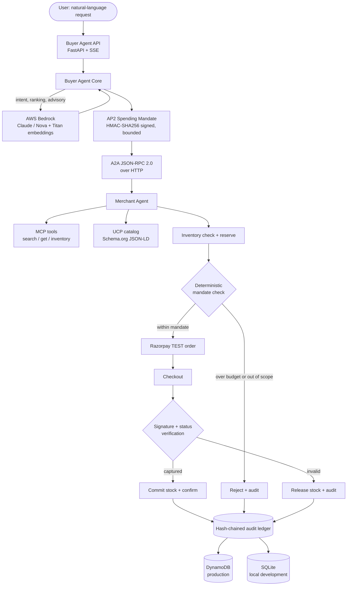
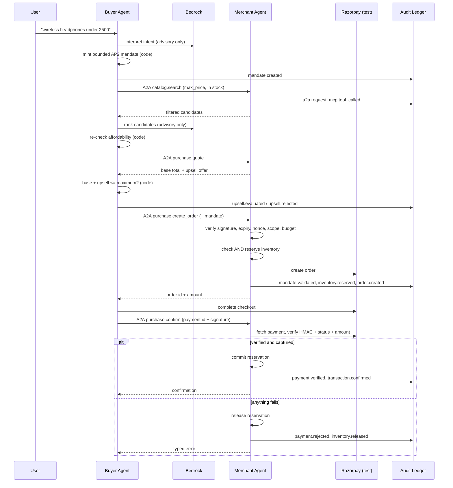

# Agentic Commerce Platform

An AI **Buyer Agent** and an AI **Merchant Agent** complete a purchase autonomously — without ever giving the buyer agent unlimited control over money.

The system rests on three guarantees:

1. The merchant exposes its catalog in an **agent-readable** way, over **MCP** and **UCP**.
2. The buyer agent operates under a **bounded AP2 spending mandate**, so it cannot overspend or act outside its authorized scope.
3. Every decision — success or failure — is recorded in a **tamper-evident, hash-chained audit ledger**.

> **It runs offline out of the box.** The default configuration uses a deterministic local AI provider and an offline Razorpay simulator, so you can clone, install and run a complete purchase with no AWS account and no Razorpay keys. Switch to Bedrock and Razorpay test mode by changing two environment variables.

---

## Table of contents

- [Quick start](#quick-start)
- [Architecture](#architecture)
- [The safety model](#the-safety-model)
- [Technology stack](#technology-stack)
- [Project structure](#project-structure)
- [Environment variables](#environment-variables)
- [AWS setup](#aws-setup)
- [Bedrock setup](#bedrock-setup)
- [Razorpay setup](#razorpay-setup)
- [Running the agents](#running-the-agents)
- [API reference](#api-reference)
- [Running the tests](#running-the-tests)
- [Docker](#docker)
- [AWS deployment](#aws-deployment)
- [Security](#security)
- [Cost awareness](#cost-awareness)
- [Troubleshooting](#troubleshooting)

Step-by-step installation instructions, including exact AWS Console clicks, are in **[SETUP.md](SETUP.md)**.

---

## Quick start

```bash
python -m venv venv
source venv/bin/activate          # Windows: venv\Scripts\activate
pip install -r requirements.txt
cp .env.example .env              # Windows: Copy-Item .env.example .env
```

Two terminals:

```bash
uvicorn merchant_agent.main:app --port 8000     # terminal 1
uvicorn buyer_agent.main:app --port 8001        # terminal 2
```

Open <http://localhost:8001> and try *"I need good wireless headphones under 2500 rupees"*.

Prefer the command line?

```bash
python scripts/smoke_test.py    # full pipeline + failure paths, in one process
pytest -v                       # 211 tests
```

---

## Architecture



### Purchase sequence



---

## The safety model

This is the part worth reading closely.

### The model never decides how much to spend

The language model does three jobs, all advisory: reading the request, ranking candidates that are *already* filtered to be affordable, and offering an opinion on whether an add-on complements a product. Everything that decides whether money moves is plain Python:

```python
if total_amount > mandate.maximum_amount:
    reject()
```

If the model hallucinates a price, invents a product id, or is prompt-injected by the merchant's product copy, the worst case is a poor *recommendation*. It cannot produce an over-budget or out-of-scope purchase. `MandateService.authorize()` compares integers and set memberships and nothing else, and there is a test (`test_model_opinion_cannot_override_the_budget`) that forces the advisory model to demand an over-budget add-on and asserts it is still refused.

### Upsell safety

The worked example from the brief: mandate ₹2000, product ₹1500, add-on ₹800 → ₹2300 total → **rejected**. The buyer re-computes the projected total itself rather than trusting the merchant's arithmetic, and checks currency, mandate scope and the `allow_upsell` flag before the budget gate.

### Inventory before payment

Stock is checked **and reserved** before a Razorpay order is created, which closes the "payment succeeded but stock was gone" window. A reservation is committed only after payment verification, and released on any failure. Availability is on-hand stock minus open reservations, so two concurrent transactions cannot both claim the last unit.

### An order is not a payment

A created order proves nothing. `verify_payment()` requires all of: a valid HMAC-SHA256 signature over `order_id|payment_id`, a payment that belongs to that order, a matching amount and currency, and a `captured` status. The expected amount is read from the merchant's own record of the order, never from the request body, so a client cannot confirm a ₹5000 order by claiming it paid ₹1.

### Money is never a float

All amounts are integers in minor units (paise). Razorpay expects the same, so no conversion happens at the payment boundary.

### Tamper evidence

```text
current_hash = SHA256(previous_hash + canonical_json(event_core))
```

`verify_ledger_integrity()` recomputes the chain and reports the first inconsistency. It detects edited payloads, edited metadata, edited `previous_hash` values, deleted events (sequence gap), reordered events, and forged appended events. Repairing one event's own hash does not help — the next event's link still fails, which is tested explicitly.

---

## Technology stack

| Layer | Choice |
|---|---|
| Backend | Python 3.11+, FastAPI, Pydantic v2 |
| AI reasoning | AWS Bedrock (Claude or Amazon Nova) via `boto3` |
| Embeddings | Amazon Titan Text Embeddings v2, or Cohere Embed on Bedrock |
| Offline fallback | Deterministic local provider (no network, no spend) |
| Agent protocols | A2A (JSON-RPC 2.0 over HTTP), MCP (HTTP + optional stdio), UCP (Schema.org JSON-LD) |
| Mandates | AP2, HMAC-SHA256 signed, single-use nonces |
| Payments | Razorpay test mode, HMAC-SHA256 signature + status verification |
| Storage | SQLite locally, DynamoDB in production; hash chain identical in both |
| Secrets | AWS Secrets Manager in production, `.env` locally |
| Observability | Structured JSON logs for CloudWatch, metric filters, alarms |
| Infrastructure | Docker, ECR, ECS Fargate, ALB, CloudFormation |
| Testing | pytest — 211 tests, fully offline |

---

## Project structure

```text
agentic-commerce-platform/
├── app/                            # Shared kernel
│   ├── core/
│   │   ├── config.py               # Settings + Secrets Manager overlay
│   │   ├── exceptions.py           # Typed errors with codes and HTTP status
│   │   ├── logging.py              # JSON logs + secret redaction
│   │   ├── http.py                 # Correlation IDs, error handlers
│   │   ├── money.py                # Integer minor-unit helpers
│   │   └── inprocess.py            # Sync ASGI transport for in-process A2A
│   ├── models/                     # mandate, catalog, ledger, protocol
│   └── services/
│       ├── ai_provider.py          # AIProvider interface + factory
│       ├── bedrock_service.py      # AWS Bedrock implementation
│       ├── local_provider.py       # Deterministic offline implementation
│       ├── embedding_service.py    # Cached embeddings + cosine ranking
│       ├── ap2.py                  # Mandates: sign, validate, enforce
│       ├── ledger.py               # Hash chain + SQLite/DynamoDB backends
│       ├── catalog_service.py      # Catalog, search, upsell selection
│       ├── inventory_service.py    # Availability and reservations
│       └── razorpay_service.py     # Orders, verification, simulator
│
├── merchant_agent/
│   ├── agent/merchant_core.py      # Purchase pipeline
│   ├── agent/a2a_handler.py        # Agent card + skill dispatch
│   ├── mcp/tools.py                # MCP tool registry
│   ├── mcp/server.py               # Optional stdio MCP server
│   ├── ucp/catalog.py              # Schema.org JSON-LD catalog
│   ├── api/                        # Routes and dependency container
│   └── main.py
│
├── buyer_agent/
│   ├── agent/buyer_core.py         # Intent, mandate, selection, upsell
│   ├── services/a2a_client.py      # A2A client
│   ├── api/                        # Routes (incl. SSE) and container
│   └── main.py
│
├── tests/                          # 211 tests
├── static/index.html               # Buyer UI
├── scripts/smoke_test.py           # End-to-end pipeline check
├── infrastructure/cloudformation.yaml
├── data/catalog.json
├── Dockerfile, docker-compose.yml
├── .env.example, .gitignore, requirements.txt, pytest.ini
└── README.md, SETUP.md
```

---

## Environment variables

Every variable is documented inline in `.env.example`. Summary:

| Variable | Required? | Notes |
|---|---|---|
| `ENVIRONMENT` | Yes | `development` / `test` / `production` |
| `LOG_LEVEL`, `LOG_FORMAT` | No | `LOG_FORMAT=json` for CloudWatch |
| `AI_PROVIDER` | Yes | `mock` (offline) or `bedrock` |
| `AWS_REGION` | With Bedrock | Must have Bedrock model access enabled |
| `AWS_ACCESS_KEY_ID` / `AWS_SECRET_ACCESS_KEY` | Local only | **Leave empty in production** — ECS task roles supply credentials |
| `AWS_PROFILE` | No | Named local profile |
| `BEDROCK_MODEL_ID` | With Bedrock | e.g. `anthropic.claude-3-5-sonnet-20240620-v1:0` |
| `BEDROCK_EMBEDDING_MODEL_ID` | With Bedrock | e.g. `amazon.titan-embed-text-v2:0` |
| `BEDROCK_GUARDRAIL_ID` / `_VERSION` | No | Applied to buyer-agent reasoning |
| `RAZORPAY_MODE` | Yes | `mock` (offline) or `test` |
| `RAZORPAY_KEY_ID` / `RAZORPAY_KEY_SECRET` | With `test` | Test keys only; live keys are refused at startup |
| `RAZORPAY_WEBHOOK_SECRET` | No | Only if you configure a webhook |
| `AP2_MANDATE_SECRET` | Yes | Generate locally; rotate via Secrets Manager |
| `AP2_MANDATE_TTL_SECONDS` | No | Mandate lifetime, default 900s |
| `AP2_ABSOLUTE_MAX_AMOUNT` | No | Hard platform ceiling in paise, default ₹5,000 |
| `LEDGER_BACKEND` | Yes | `sqlite` or `dynamodb` |
| `DATABASE_URL` / `BUYER_DATABASE_URL` | Local only | SQLite paths |
| `DYNAMODB_TABLE_NAME` | Production | Created by CloudFormation |
| `SECRETS_MANAGER_SECRET_NAME` | Production | JSON bundle overlaid at startup |
| `KMS_KEY_ID` | No | Optional table encryption key |
| `A2A_API_KEY` | Yes | Shared secret for buyer → merchant calls |
| `MERCHANT_AGENT_URL` / `BUYER_AGENT_URL` | Yes | Defaults suit local runs |

---

## AWS setup

Exact Console steps are in **[SETUP.md](SETUP.md)**. In brief:

1. Install and configure the AWS CLI (`aws configure`), region `ap-south-1` or another Bedrock region.
2. In the Bedrock console, request access to your chat model and your embedding model.
3. Deploy `infrastructure/cloudformation.yaml` — it creates the DynamoDB ledger, Secrets Manager secret, ECR repositories, log groups, IAM roles, the ECS cluster and an ALB.
4. Fill in the `acp/app` secret with your Razorpay test keys, AP2 secret and A2A key.
5. Build and push the images, then set `DesiredCount` to 1.

Required IAM permissions for the task role (already encoded in the template, least-privilege): `bedrock:InvokeModel` and `bedrock:Converse` on the two model ARNs; `dynamodb:PutItem`, `Query`, `GetItem` on the ledger table (deliberately **no** `UpdateItem` or `DeleteItem` — the ledger is append-only); `secretsmanager:GetSecretValue` on the one secret; `cloudwatch:PutMetricData` scoped to the project namespace.

---

## Bedrock setup

Set `AI_PROVIDER=bedrock` and make sure credentials resolve (`aws sts get-caller-identity`). Bedrock plugs in at exactly two places:

- `buyer_agent/agent/buyer_core.py` → intent interpretation, candidate ranking, upsell advisory, all via the `AIProvider` interface.
- `app/services/embedding_service.py` → catalog semantic search via Titan or Cohere embeddings.

No Bedrock calls are scattered elsewhere; `app/services/bedrock_service.py` is the only module that imports boto3 for AI. There is no Gemini dependency and no `GEMINI_API_KEY` anywhere in the project.

Guardrails: set `BEDROCK_GUARDRAIL_ID` and the agent attaches the guardrail to every text call, and treats `guardrail_intervened` as a failure rather than a usable answer.

---

## Razorpay setup

`RAZORPAY_MODE=mock` (default) uses an in-process simulator that produces genuine HMAC signatures, so the verification path is exercised without a network.

`RAZORPAY_MODE=test` uses the real Razorpay test API. Create a free account, switch the dashboard to **Test Mode**, generate API keys, and put `rzp_test_...` and its secret in `.env`. A key that does not start with `rzp_test_` is rejected at startup — the project cannot be pointed at live credentials by accident.

---

## Running the agents

| Command | Purpose |
|---|---|
| `uvicorn merchant_agent.main:app --port 8000` | Merchant agent |
| `uvicorn buyer_agent.main:app --port 8001` | Buyer agent + UI |
| `python scripts/smoke_test.py` | Full pipeline and failure paths in one process |
| `python -m merchant_agent.mcp.server` | Optional stdio MCP server (needs `pip install "mcp>=1.2.0"`) |
| `pytest -v` | Test suite |

Interactive API docs: <http://localhost:8000/docs> and <http://localhost:8001/docs>.

---

## API reference

### Buyer agent (port 8001)

| Method | Path | Description |
|---|---|---|
| `GET` | `/` | Demo UI |
| `GET` | `/health` | Status, AI provider, ledger info |
| `POST` | `/purchase` | Run a purchase, return the full decision trail |
| `POST` | `/purchase/stream` | Same, streamed as SSE (`step` events then `outcome`) |
| `GET` | `/merchant/card` | Proxy the merchant's A2A agent card |
| `GET` | `/ledger/verify` | Verify the buyer's hash chain |
| `GET` | `/ledger/events` | Read events, optionally by `transaction_id` |

### Merchant agent (port 8000)

| Method | Path | Description |
|---|---|---|
| `GET` | `/health` | Status |
| `GET` | `/.well-known/agent.json` | A2A agent card |
| `GET` | `/catalog` | UCP Schema.org JSON-LD catalog |
| `GET` | `/catalog/products`, `/catalog/products/{id}` | Plain JSON catalog |
| `POST` | `/inventory/check` | Availability |
| `GET` | `/mcp/tools` | MCP tool definitions |
| `POST` | `/mcp` | MCP JSON-RPC (`tools/list`, `tools/call`) |
| `POST` | `/a2a/message` | A2A JSON-RPC (`message/send`) — requires `X-A2A-Key` |
| `POST` | `/quote`, `/order`, `/order/confirm` | REST commerce endpoints |
| `POST` | `/payments/simulate` | Offline checkout simulator (mock mode only) |
| `POST` | `/webhooks/razorpay` | Webhook receiver; rejects unsigned payloads |
| `GET` | `/ledger/verify`, `/ledger/events` | Audit access |

A2A skills: `catalog.search`, `catalog.get_product`, `inventory.check`, `purchase.quote`, `purchase.create_order`, `purchase.confirm`.

---

## Running the tests

```bash
pytest -v            # 211 tests
pytest -v -k ap2     # one area
```

Tests never touch AWS, never call Razorpay and never spend money: Bedrock is faked at the boto3 client boundary, Razorpay runs through the simulator, and the two agents talk to each other over an in-process ASGI transport using the real client code path.

Coverage by area: AP2 mandates (26), audit ledger (20), inventory (18), upsell safety (14), Razorpay (25), AI providers and embeddings (26), MCP/UCP/A2A protocols (35), merchant API (25), end-to-end and buyer API (22).

---

## Docker

Docker is optional; the virtualenv path above is fully supported.

```bash
cp .env.example .env
docker compose up --build      # UI on http://localhost:8001
```

---

## AWS deployment

```text
Docker image → ECR → ECS Fargate (buyer + merchant) → ALB
                        ↓
        Bedrock · DynamoDB ledger · Secrets Manager · CloudWatch
```

**Automatic** (created by CloudFormation): DynamoDB table with its GSI, Secrets Manager secret shell, two ECR repositories, CloudWatch log groups, metric filters and an alarm, IAM execution and task roles, security groups, ALB and target group, ECS cluster, task definitions, services and private service discovery.

**Manual** (you must do these): enable Bedrock model access, fill in the secret values, build and push the two images, set `DesiredCount` to 1, and — if you use Razorpay test mode — point a webhook at the ALB.

See SETUP.md for the exact commands.

---

## Security

- No secrets in the repository. `.env` is gitignored; `.env.example` contains placeholders only.
- Secrets are redacted from logs by a filter that scans both messages and structured fields, and ledger payloads are redacted before they are hashed and written.
- Mandates are HMAC-signed, expiring, scope-limited, capped by a platform ceiling, and single-use via a nonce store that survives restarts.
- Agent-to-agent calls require a shared key compared in constant time.
- Order prices come from the catalog; client-supplied prices are ignored. Payment amounts come from the merchant's own order record.
- Webhooks without a valid signature are rejected before parsing.
- The DynamoDB task policy grants no `UpdateItem` or `DeleteItem`, so the ledger is append-only at the IAM layer too.
- Live Razorpay keys are refused at startup.

---

## Cost awareness

Running fully offline (`AI_PROVIDER=mock`, `RAZORPAY_MODE=mock`) costs nothing.

What can incur charges when deployed:

| Resource | Cost profile |
|---|---|
| Bedrock model invocations | Per token. The largest driver; embeddings are cached to avoid repeat calls |
| ECS Fargate tasks | Per second while running — **set `DesiredCount` to 0 when idle** |
| Application Load Balancer | Hourly, whether or not traffic flows. Delete the stack when finished |
| DynamoDB | On-demand billing; negligible at prototype volume |
| Secrets Manager | About $0.40 per secret per month |
| CloudWatch Logs | Per GB ingested; retention is capped at 14 days |
| ECR | Per GB stored; a lifecycle policy keeps only 5 images |

Razorpay test mode is free and never moves real money.

---

## Troubleshooting

| Symptom | Cause and fix |
|---|---|
| `AccessDeniedException` from Bedrock | Model access not granted in that region. Bedrock console → Model access. |
| `ValidationException` naming the model | `BEDROCK_MODEL_ID` is wrong for the region; check the exact id in the console. |
| Startup fails: live key refused | `RAZORPAY_KEY_ID` is an `rzp_live_` key. Use test-mode keys. |
| `401` from the merchant | `A2A_API_KEY` differs between the two agents. |
| `mandate_replay_detected` | Each mandate is single-use; mint a new one per purchase. |
| `mandate_expired` | Default TTL is 15 minutes; raise `AP2_MANDATE_TTL_SECONDS` if debugging slowly. |
| "No in-stock product matches" | Budget below every candidate, or the catalog is out of stock. |
| Ledger reports tampering | Expected if you edited the `.db` by hand. Delete `data/*.db` to start a fresh chain. |
| Port already in use | Change `--port`, and update `MERCHANT_AGENT_URL` to match. |
| UI shows "agent offline" | The buyer agent is not running on 8001. |
